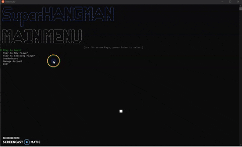
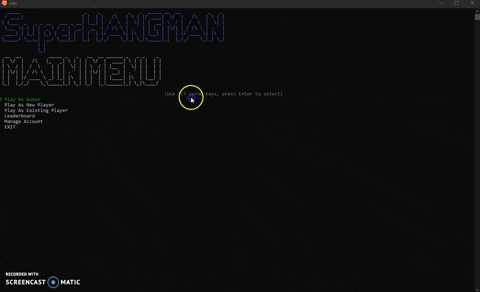
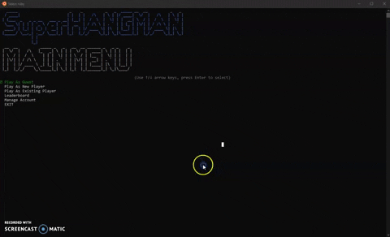
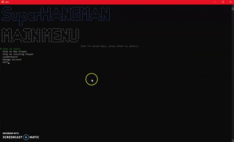
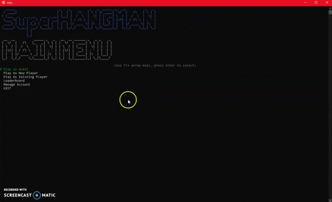

# Welcome to SuperHangman!

## Installation
To Run:
1. Ruby must be installed
2. Click "Clone or Download" from above
3. Navigate to the directory where the program is installed from terminal
4. In your terminal run bundle install
5. rake :db migrate
6. rake :db seed
7. Finally to run the program type "ruby runner.rb"

## Usage Instructions From Main Menu

### Play as Guest
	1) The player will be prompted to select a category, at this point a random word will be selected
	2) The game will begin with the player being asked to enter a character to guess
	3) Upon making a correct letter choice the letter will appear in the row repenting the mystery word
	4) If the player selects an incorrect letter a piece of the condemned soul will appear, as well as the incorrect letter will be shown in the wrong guesses section of the screen
	5) The game is won by guessing all of the correct letters to the puzzle and the correct answer will be displayed
	6) If the player should submit six incorrect guesses the condemned soul will be hung and the correct answer will be displayed
	7) The player will be given a choice to play again
	8) If the player should choose to play agin they will be presented with the choice of a new category
	9) If the player should choose not to play agin the player will be returned to the main menu
	
   

### Play as New Player
	1) The player will be greeted with the phrase “Welcome to Hangman! What should your wanted poster read?”
	2) The player will enter the name of their choice
	3) The player will be prompted to select a category, at this point a random word will be selected
	4) The game will begin with the player being asked to enter a character to guess
	5) Upon making a correct letter choice the letter will appear in the row repenting the mystery word
	6) If the player selects an incorrect letter a piece of the condemned soul will appear, as well as the incorrect letter will be shown in the wrong guesses section of the screen
	7) The game is won by guessing all of the correct letters to the puzzle and the correct answer will be displayed
	8) If the player should submit six incorrect guesses the condemned soul will be hung and the correct answer will be displayed
	9) The player will be given a choice to play again
	10) If the player should choose to play agin they will be presented with the choice of a new category
	11) If the player should choose not to play agin the player will be returned to the main menu

   
   
### Play as Existing Player
	1) The player will be gasket to enter their name
	2) The player will enter the name they have used in previous games, case is not a factor
	3) The player will be prompted to select a category, at this point a random word will be selected
	4) The game will begin with the player being asked to enter a character to guess
	5) Upon making a correct letter choice the letter will appear in the row repenting the mystery word
	6) If the player selects an incorrect letter a piece of the condemned soul will appear, as well as the incorrect letter will be shown in the wrong guesses section of the screen
	7) The game is won by guessing all of the correct letters to the puzzle and the correct answer will be displayed
	8) If the player should submit six incorrect guesses the condemned soul will be hung and the correct answer will be displayed
	9) The player will be given a choice to play again
	10) If the player should choose to play agin they will be presented with the choice of a new category
	11) If the player should choose not to play agin the player will be returned to the main menu
	

### Leaderboard
	1) The player will be presented with a list of the current high scores for the game
	2) The player will be asked if they would like to return to the main menu
	

### Manage Account
	1) The player will be promoted with “Hi! What would you like to do with your account?”
	2) The player will be present with the choice to delete their account or to return to the main menu
	

 ### Exit
	1) The player will be returned to their terminal
